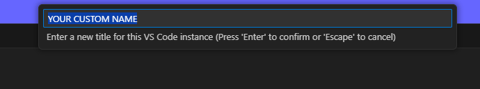

# VS Code Instance Rename

A simple VS Code extension that allows you to rename VS Code window instances for easier identification when running multiple instances in parallel.

## Features

- **Rename Window Title**: Use the command palette to set a custom title for your VS Code instance
- **Persistent Titles**: Titles are saved in workspace settings and persist across sessions
- **Easy Window Switching**: Quickly identify which VS Code instance you need when Alt+Tabbing

## How to Use

### Step 1: Open the Command Palette

Open the Command Palette using `Ctrl+Shift+P` (Windows/Linux) or `Cmd+Shift+P` (Mac):

### Step 2: Provide Your Custom Name

Type a custom name for your VS Code instance when prompted:

### Step 3: Confirm the Change

Your custom name is applied and persists across sessions:

The window title will update immediately and persist across sessions.

## Why This Extension?

When running multiple VS Code instances with various AI agents or different workspaces, it can be difficult to identify which window is which:
- Branch names are too small in the UI
- Peacock colors have limited differentiation at a glance
- Workspace paths aren't descriptive enough

A custom window title shows up prominently when switching windows (Alt+Tab), making it easy to find the instance you need.

## Installation

Install from the VS Code Marketplace or build from source.

## License

ISC
